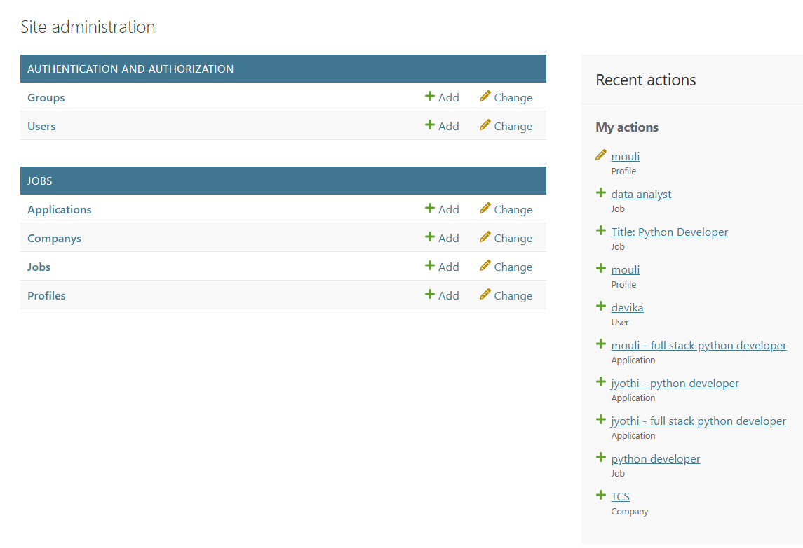
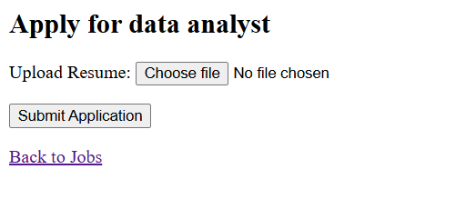
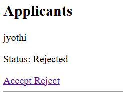
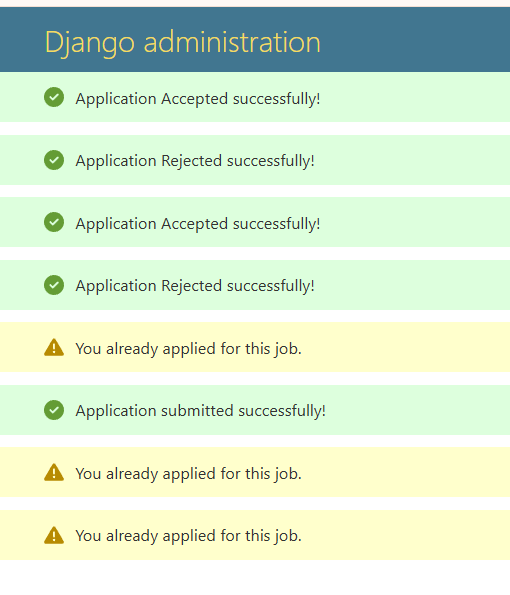

AI-Powered Job Portal (Django)

A full-stack Job Portal Web Application built using Django and Python, featuring an AI-based Job Recommendation System that intelligently suggests jobs based on candidate skills.

🔥 Key Highlights
🤖 AI-powered job recommendations (TF-IDF + Cosine Similarity)
👨‍💼 Separate dashboards for Candidates & Employers
📄 Resume upload & application tracking
📊 Employer analytics (applicant count per job)
🔐 Secure authentication system
🛠️ Tech Stack
Backend: Python, Django
Frontend: HTML, CSS, Django Templates
Database: SQLite
AI Model: TF-IDF + Cosine Similarity (scikit-learn)
Others: File Upload (Resume Handling)
✨ Features
👩‍💻 Candidate
Login / Logout authentication
Search jobs with filters
Apply with resume upload
View applied jobs
🤖 AI Recommended Jobs
🧑‍💼 Employer
Post and manage jobs
View applicants
Accept / Reject applications
Dashboard analytics
🛡️ Admin
Manage users, jobs, companies
Full CRUD operations
⚙️ Installation & Setup
# Clone repository
git clone https://github.com/takurdavila-ui/ai-job-portal-django.git
cd ai-job-portal-django

# Create virtual environment
python -m venv venv

# Activate environment
# Windows
venv\Scripts\activate
# Mac/Linux
source venv/bin/activate

# Install dependencies
pip install -r requirements.txt

# Run migrations
python manage.py migrate

# Create admin
python manage.py createsuperuser

# Run server
python manage.py runserver

👉 Open: http://127.0.0.1:8000/

🤖 AI Recommendation Logic
Extract candidate skills
Compare with job requirements
Use TF-IDF + Cosine Similarity
Rank jobs based on similarity score
📸 Screenshots

🚧 Future Improvements

📥 Resume download option

📱 Mobile responsive UI

⭐ Saved jobs feature

🔔 Notifications system

🧠 Advanced ML/DL recommendations

👩‍🎓 Author

Devisri Thakur
BTech Student | AI & Web Development Enthusiast

📧 Email: takurdavila@gmail.com

🔗 GitHub: https://github.com/takurdavila-ui

📄 License

This project is licensed under the MIT License
